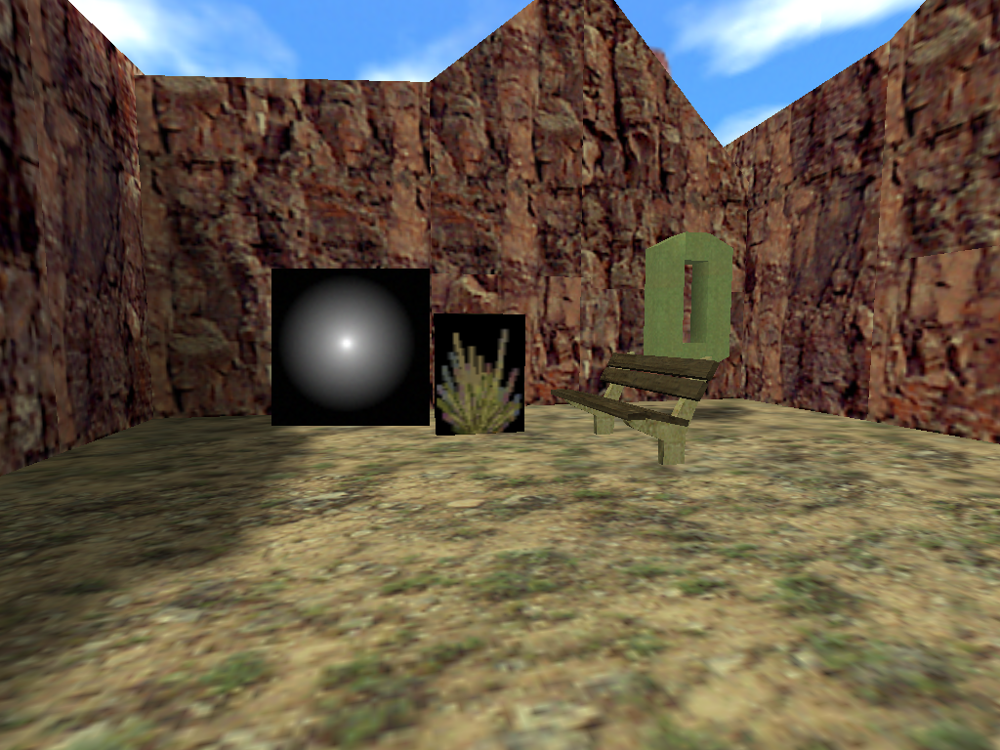
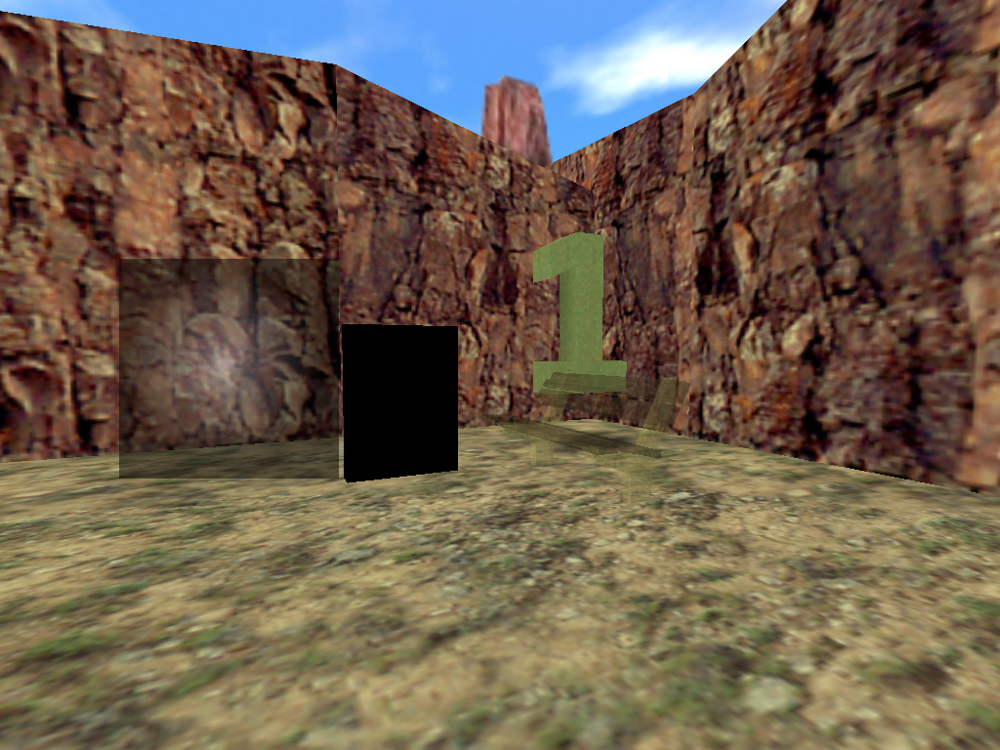
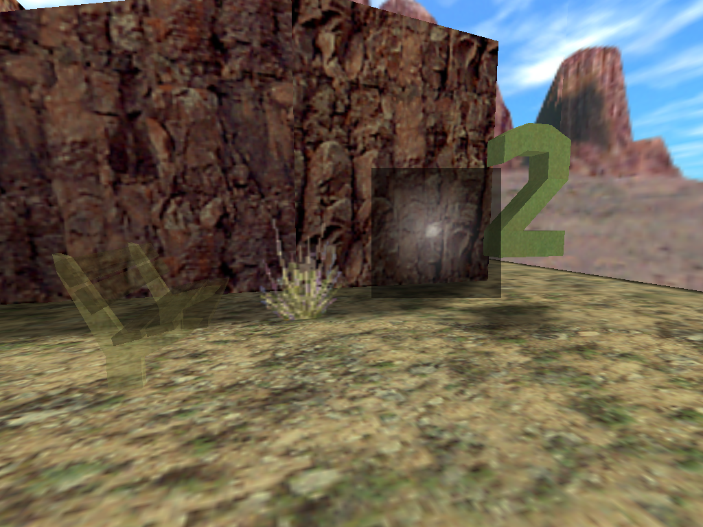
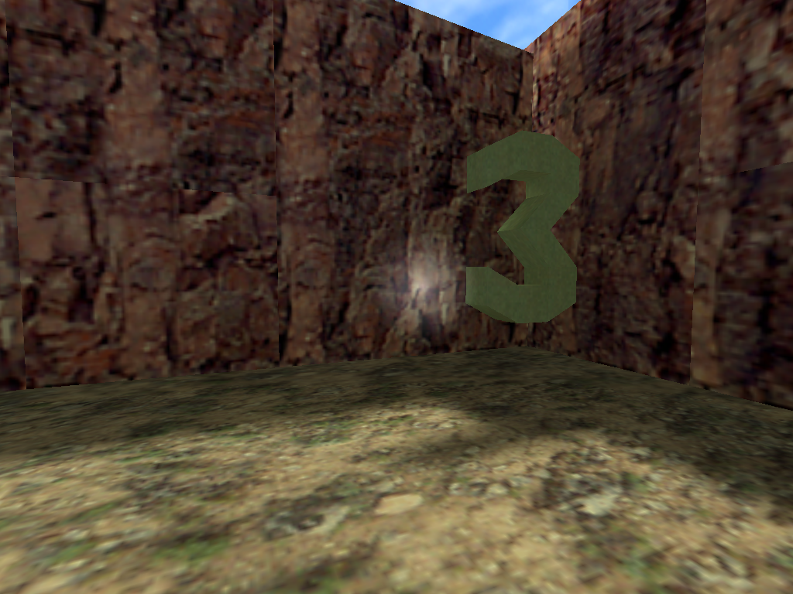
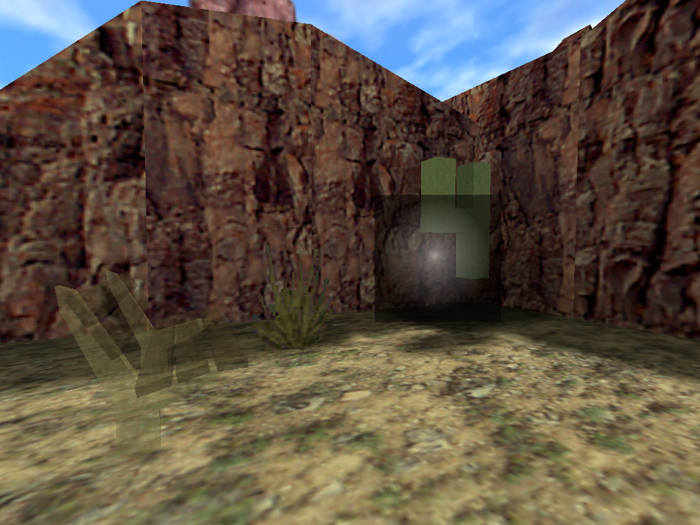
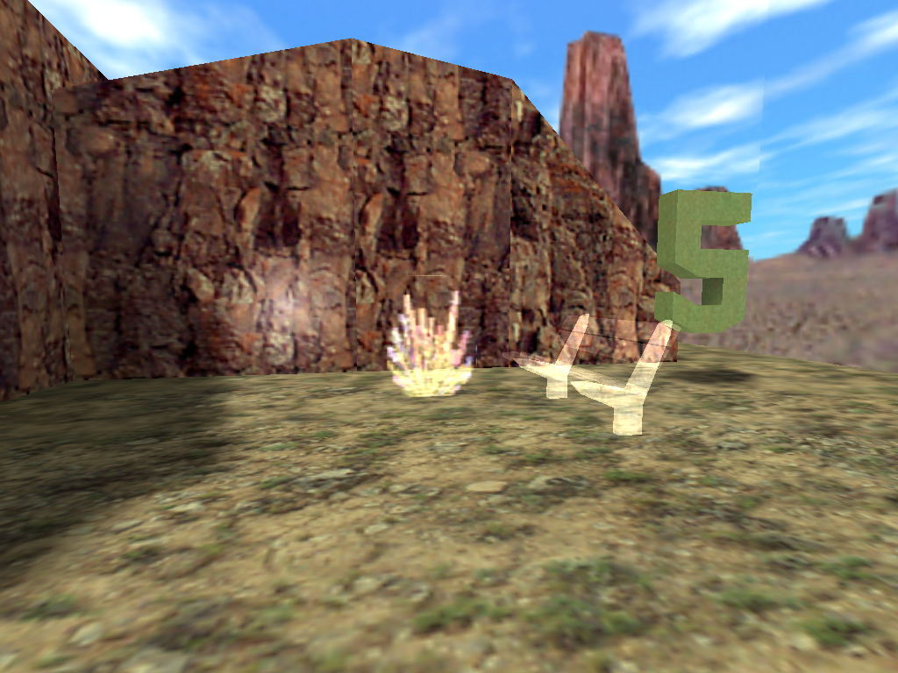

# GenMap

## TODO

[x] Make loading an asset more generic so a sprite or studio model can also be the asset loaded from arguments
[x] Support sprites
[ ] Shade the models from their environment (find the closest face and extract an average color from its lightmap)
[ ] Make the code base compile on linux (see older opengl projects for example code)
[ ] Render all bsp models, not only the worldspawn
[ ] Make sure all render modes are working
[ ] Add imgui windows for render settings

## Render modes

The following render modes are supported by the GoldSrc engine.

### NormalBlending = 0

The ``FX Amount`` is set to 128 on the cycler_sprite and env_sprite, and 255 on the brush.

### ColorBlending = 1

The ``FX Amount`` is set to 128 on the cycler_sprite and env_sprite, and 255 on the brush.

### TextureBlending = 2

The ``FX Amount`` is set to 128 on the cycler_sprite and env_sprite, and 255 on the brush.

### GlowBlending = 3

The ``FX Amount`` is set to 128 on the cycler_sprite and env_sprite, and 255 on the brush.

Only sprite can be set to glow, an MDL of a gemetry model will trigger an erro in the console.

### SolidBlending = 4

The ``FX Amount`` is set to 255 on all the entities.

### AdditiveBlending = 5

The ``FX Amount`` is set to 128 on the cycler_sprite and env_sprite, and 255 on the brush.

